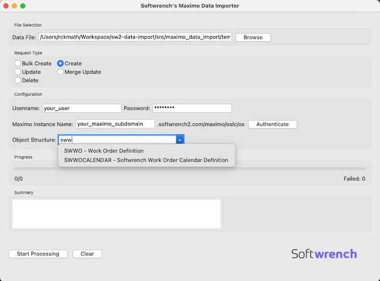

# Maximo Data Importer

A Python-based GUI application for importing data into IBM Maximo through its OSLC REST API. This tool supports various operations including create, update, merge update, and delete operations for Maximo objects.



## Features

- User-friendly graphical interface
- Support for CSV and JSON input files
- Multiple operation modes:
  - Bulk Create
  - Create
  - Update
  - Merge Update
  - Delete
- Real-time progress tracking
- Detailed operation summary
- Authentication handling

## Prerequisites

Before running the application, ensure you have:

1. Python 3.7 or higher installed
2. Access to a Maximo instance with OSLC API enabled
3. Valid Maximo credentials
4. Required Python packages (see Installation section)

## Installation

1. Clone this repository or download the source code:
```bash
git clone <repository-url>
cd path/to/maximo-data-importer
```

2. Create and activate a virtual environment (recommended):
```bash
# Windows
python -m venv venv
venv\Scripts\activate

# macOS/Linux
python3 -m venv venv
source venv/bin/activate
```

3. Install required packages:
```bash
pip install -r requirements.txt
```

## Required Packages

Create a `requirements.txt` file with the following dependencies:
```txt
pillow>=10.0.0  # For image handling (PIL/ImageTk)
requests>=2.31.0  # For making HTTP requests to Maximo API
tkinter  # Usually comes with Python installation, for the GUI
```

### Note about dependencies:

1. **pillow**: Required for image processing (logo handling in the UI)
   - Used by `PIL.Image` and `PIL.ImageTk`
   - Handles image loading and resizing

2. **requests**: Required for Maximo API communication
   - Used for all HTTP operations with Maximo
   - Handles authentication and data transfer

3. **tkinter**: Core GUI framework
   - Usually comes bundled with Python
   - No need to install separately unless using minimal Python installation

To install all dependencies at once:
```bash
pip install -r requirements.txt
```

If tkinter is missing from your Python installation:
- **Ubuntu/Debian**: `sudo apt-get install python3-tk`
- **Fedora**: `sudo dnf install python3-tkinter`
- **Windows**: Reinstall Python and make sure to check "tcl/tk and IDLE" during installation
- **macOS**: Comes with Python if installed through official installer or Homebrew

## Usage

1. Start the application:
```bash
python maximo_sender_ui.py
```

2. Configure the import:
   - Select your data file (CSV or JSON)
   - Choose the request type
   - Enter your Maximo instance name
   - Provide the object structure
   - Enter your Maximo credentials

3. For Update/Merge Update/Delete operations, additional configuration is required:
   - Search Attribute: Field used to find existing records
   - ID Attribute: Unique identifier field
   - OSLC Where: Query condition for finding records
   - OSLC Select: Fields to retrieve during search

4. Click "Start Processing" to begin the import

## Data File Format

### CSV Format
Your CSV file should have headers matching the Maximo object attributes. Special formatting options:
- `field[subfield]`: Creates nested objects
- `field{subfield}`: Creates object properties
- Date fields are automatically parsed if in standard formats

Example:
```csv
assetnum,description,status,siteid
ASSET001,Test Asset,ACTIVE,SITE1
```

### JSON Format
Alternatively, you can provide data in JSON format:
```json
[
  {
    "assetnum": "ASSET001",
    "description": "Test Asset",
    "status": "ACTIVE",
    "siteid": "SITE1"
  }
]
```

## Error Handling

- Failed operations are logged in a `*_failed_requests.log` file
- The application shows real-time progress and a summary of successful/failed operations
- Detailed error messages are displayed for troubleshooting

## Limitations

- Maximum file size for CSV conversion: 100MB
- Concurrent operations: 3 threads (configurable in code)
- Timeout for individual operations: 30 seconds

## Troubleshooting

1. **Connection Issues**
   - Verify your Maximo instance URL
   - Check your network connection
   - Ensure your credentials are correct

2. **File Format Issues**
   - Verify CSV column headers match Maximo attributes
   - Check for special characters in the data
   - Ensure date formats are standard

3. **Processing Errors**
   - Check the failed requests log for details
   - Verify object structure permissions in Maximo
   - Ensure required fields are provided

## Contributing

Contributions are welcome! Please feel free to submit pull requests or create issues for bugs and feature requests.

## Acknowledgments

- Built using Python's tkinter for the GUI
- Uses IBM Maximo's OSLC API

## Support

For support, please:
1. Check the troubleshooting section
2. Review existing issues
3. Create a new issue with detailed information about your problem
